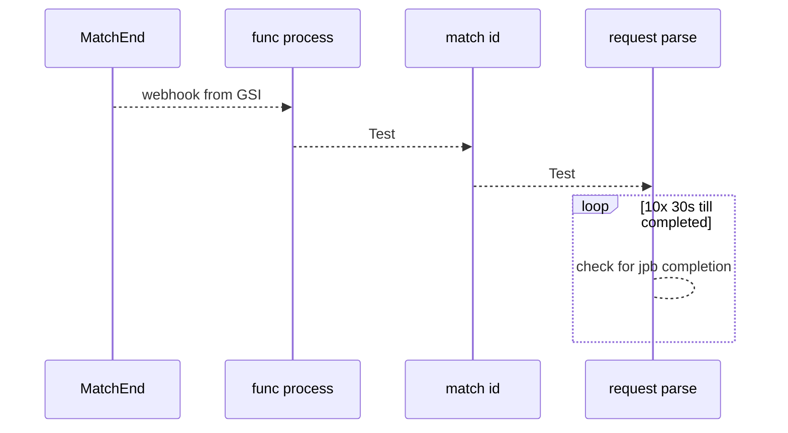
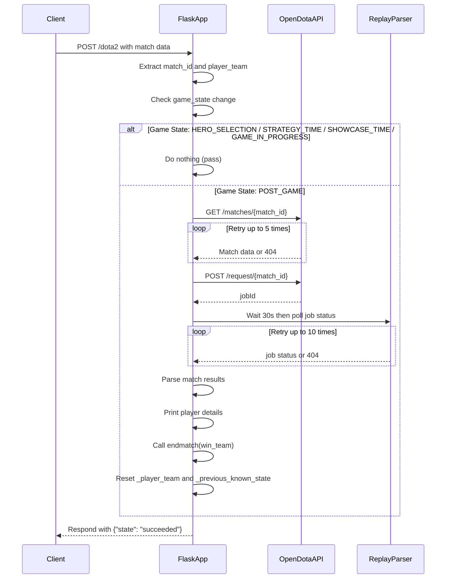

```mermaid
sequenceDiagram
    participant MatchEnd
    participant func process
    participant match id
    participant request parse

    MatchEnd-->>func process: webhook from GSI
    func process-->>match id: Test
    match id-->>request parse: Test
    loop 10x 30s till completed
    request parse-->request parse: check for jpb completion
    end
```

```mermaid
sequenceDiagram
    participant Client
    participant FlaskApp
    participant OpenDotaAPI
    participant ReplayParser

    Client->>FlaskApp: POST /dota2 with match data
    FlaskApp->>FlaskApp: Extract match_id and player_team
    FlaskApp->>FlaskApp: Check game_state change

    alt Game State: HERO_SELECTION / STRATEGY_TIME / SHOWCASE_TIME / GAME_IN_PROGRESS
        FlaskApp->>FlaskApp: Do nothing (pass)
    else Game State: POST_GAME
        FlaskApp->>OpenDotaAPI: GET /matches/{match_id}
        loop Retry up to 5 times
            OpenDotaAPI-->>FlaskApp: Match data or 404
        end

        FlaskApp->>OpenDotaAPI: POST /request/{match_id}
        OpenDotaAPI-->>FlaskApp: jobId

        FlaskApp->>ReplayParser: Wait 30s then poll job status
        loop Retry up to 10 times
            ReplayParser-->>FlaskApp: job status or 404
        end

        FlaskApp->>FlaskApp: Parse match results
        FlaskApp->>FlaskApp: Print player details

        FlaskApp->>FlaskApp: Call endmatch(win_team)
        FlaskApp->>FlaskApp: Reset _player_team and _previous_known_state
    end

    FlaskApp-->>Client: Respond with {"state": "succeeded"}
```